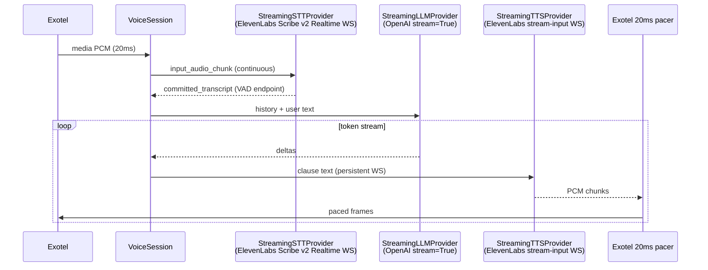

# Low-Latency Streaming Pipeline

Production compound pipeline (`VOICE_PIPELINE=compound`) now uses overlapping streaming stages by default.

## Architecture



## Old vs New

| Stage | Before | After |
|-------|--------|-------|
| Turn detection | Local VAD + 800ms silence | ElevenLabs STT VAD commit (~450ms configurable) |
| STT | Batch REST upload after utterance | WebSocket `scribe_v2_realtime` while user speaks |
| OpenAI | Already `stream=True` | Unchanged — tokens flow immediately |
| Text → TTS | Full sentence buffer + HTTP per sentence | Clause buffer (3+ words) + persistent TTS WebSocket |
| TTS → Exotel | Already streamed PCM | Unchanged pacing (20ms clock) |

## Provider interfaces

| Interface | Default impl | Alternatives |
|-----------|--------------|--------------|
| `StreamingSTTProvider` | `ElevenLabsStreamingSTTProvider` | `DeepgramStreamingSTTProvider` (`STT_PROVIDER=deepgram`, requires `deepgram-sdk`) |
| `StreamingLLMProvider` | `OpenAIStreamingLLMProvider` | (swap via factory) |
| `StreamingTTSProvider` | `ElevenLabsWebSocketTTSProvider` | `ElevenLabsHttpTTSProvider` (`TTS_PROVIDER=http`) |

Verified APIs (not invented):

- STT: `wss://api.elevenlabs.io/v1/speech-to-text/realtime` ([docs](https://elevenlabs.io/docs/api-reference/speech-to-text/v-1-speech-to-text-realtime))
- TTS: `wss://api.elevenlabs.io/v1/text-to-speech/{voice_id}/stream-input` ([docs](https://elevenlabs.io/docs/eleven-api/guides/how-to/websockets/realtime-tts))
- LLM: OpenAI Chat Completions `stream=True` (existing)

## Files modified / added

**New**

- `app/streaming/providers/base.py` — provider protocols
- `app/streaming/providers/elevenlabs_stt.py`
- `app/streaming/providers/deepgram_stt.py`
- `app/streaming/providers/openai_llm.py`
- `app/streaming/providers/elevenlabs_tts_ws.py`
- `app/streaming/providers/elevenlabs_tts_http.py`
- `app/streaming/clause_buffer.py`
- `app/streaming/factory.py`
- `app/streaming/turn_runner.py`
- `app/streaming/session_controller.py`

**Modified**

- `app/voice_session.py` — streaming audio path, paced frame helper, greeting via WS TTS
- `app/config.py` — streaming env vars, reduced `VAD_END_SILENCE_MS` default (batch rollback)
- `.env.example` — streaming configuration
- `app/voice_pipeline/compound/session.py`, `factory.py`, `README.md`

**Unchanged (business logic)**

- `ai_server.py`, `agent_setup.py`, `lovable_client.py`, `supabase_agent_provider.py`
- CRM call logs, agent prefetch, Exotel WSS protocol, `TURN_TIMELINE` logging

## Expected latency improvement

Approximate **caller last word → first bot audio (TTFA)**:

| Component | Before (typical) | After (expected) |
|-----------|------------------|------------------|
| End-of-speech wait | ~800ms local VAD | ~450ms STT VAD |
| STT | ~400–800ms batch REST | ~50–200ms (overlap + commit) |
| LLM first clause | +800–2500ms | +800–2500ms (unchanged) |
| TTS first byte | +200–400ms per HTTP sentence | +100–250ms (persistent WS) |
| Sentence/clause buffer | +0–800ms | +100–300ms (shorter clauses) |
| **Total TTFA** | **~2.3–4.5s** | **~1.2–2.4s** |

Best case improvement: **~900–2000ms** off time-to-first-audio.

Measure with existing `TURN_TIMELINE` logs (`first_packet`, `tts_first_byte`, `llm_first_sentence`).

## Rollback

1. **Full legacy pipeline**

   ```env
   STREAMING_PIPELINE=false
   ```

   Restores batch ElevenLabs REST STT + local VAD + sentence HTTP TTS.

2. **Partial rollback**

   ```env
   STREAMING_PIPELINE=true
   TTS_PROVIDER=http
   STT_PROVIDER=elevenlabs
   ```

3. **Alternate stack**

   ```env
   VOICE_PIPELINE=openai_realtime
   ```

## Risks

| Risk | Mitigation |
|------|------------|
| STT VAD cuts off slow speakers | Tune `STREAMING_STT_VAD_SILENCE_SECS` (default 0.45) |
| Telephony echo poisons STT | Echo guard + don't forward audio while bot speaks (unless barge-in) |
| TTS WS idle timeout | Keepalive spaces + `STREAMING_TTS_WS_INACTIVITY_TIMEOUT=180` |
| **Stutter after first clause** | Fixed: ignore ElevenLabs `isFinal` between clauses; only honor after `flush_utterance` (`""` text). See `LATENCY_TURN` `tts_premature_is_final` / `pcm_underflows` |
| Clause prosody | Tune `STREAMING_CLAUSE_MIN_WORDS` / `STREAMING_CLAUSE_MAX_CHARS` |
| Deepgram path | Experimental — requires `deepgram-sdk`; ElevenLabs is production default |
| Concurrent WS connections | Existing `MAX_CONCURRENT_STT` / `MAX_CONCURRENT_TTS` semaphores retained |

## Latency tracing

Set `ENABLE_LATENCY_TRACE=true` (default). Each turn emits `LATENCY_TURN`; each call emits `LATENCY_CALL` on disconnect.

Key fields for stutter diagnosis:

- `tts_premature_is_final` — should be **0** after the isFinal fix
- `pcm_underflows` / `pcm_underflow_total_ms` — TTS audio starvation (playback waited with no PCM)
- `tts_chunk_interval_p95` — gaps between ElevenLabs audio chunks
- `exotel_send_p95` — WebSocket send latency to Exotel
- `bottleneck` — heuristic in `LATENCY_CALL` summary

## Environment variables

See `.env.example` section **Low-latency streaming pipeline**.
